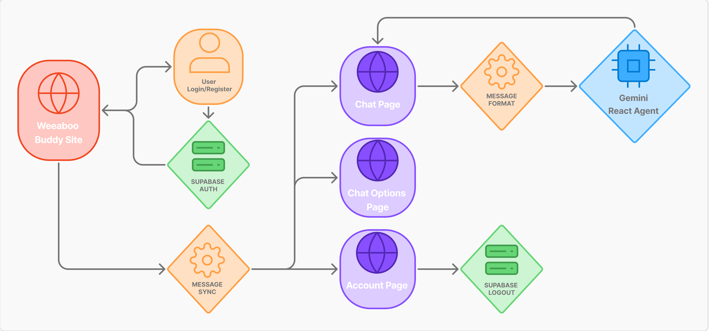

<a name="readme-top"></a>

<div align="center">
  <h1>Weeaboo-Buddy</h1>
</div> <br>

<details open>
<summary>Table of Contents</summary>
<ol>
  <li>
    <a href="#introduction">Introduction</a>
  </li>
  <li>
    <a href="#features">Features</a>
    <ul>
      <li>
        <a href="#built-with">Built With</a>
      </li>
      <li>
        <a href="#workflow">Workflow</a>
      </li>
    </ul>
  </li>
  <li>
    <a href="#getting-started">Getting Started</a>
    <ul>
      <li><a href="#prerequisites">Prerequisites</a></li>
      <li><a href="#setup">Setup</a></li>
    </ul>
  </li>
  <li><a href="#demo">Demo</a></li>
  <li><a href="#contributing">Contributing</a></li>
  <li><a href="#license">License</a></li>
</ol>
</details>

## Introduction
One day while I was sitting by my desk, I pondered about the next project I wanted to make, I started to think about the various topics I wanted to work on and two things came to mind, Agents and a personal interest. I began to think about what in my life could use and benefit from an AI Agent powered by an LLM, and thought of one thing immediately, anime. I then decided my project would be an AI Anime helper, fitted with several tools that would help anyone curious about various aspects of anime have a one-stop shop that would elimnate the need of having to do in depth research themselves, or go down rabbit holes they would not want to or have the time to go down. I hope you enjoy, and please feel free to leave any issue you have so I can improve this tool, thank you!
 
## Features
- User Authentication!
- Agent Chatbot!
- Image Input Support!
- Device Chat Sync!
- Chat Export!
- Chat History Clear!

### Built With
[![Python][Python]][Python-url]
[![Google Gemini][Gemini]][Gemini-url]
[![LangChain][LangChain]][LangChain-url]
[![LangGraph][LangGraph]][LangGraph-url]
[![Tavily][Tavily]][Tavily-url]
[![APIs][APIs]][APIs-url]
[![Streamlit][Streamlit]][Streamlit-url]

### App Flow
<div align="center">
  
</div> <br>
<p align="right"><a href="#readme-top">Back to top</a></p>

## Getting Started
To get a local copy of Weeaboo-Buddy up and running locally follow these steps:  

### Prerequisites
1. Make sure you have Python installed and use Python3 version 3.12   
**NOTE:** You can check if Python is installed and its version with 
    ```sh
    python -V | python --version
    ```
2. Make sure you have Git installed  
**NOTE:** You can check if Git is installed and its version with
    ```sh
    git -v | git --version
    ```

### Setup
1. Navigate to the directory where you want to clone/run/save the application:
    ```sh
    cd example_directory
    ```
2. Clone the repository:
    ```sh
    git clone https://github.com/drod75/Weeaboo-Buddy.git
    ```
3. Navigate to the project directory:
    ```sh
    cd Weeaboo-Buddy
    ```
4. Next, create a Python virtual environment in the cloned project directory:
    ```sh
    python3.12 -m venv .venv
    ```
5. Activate the virtual environment (Windows OR Mac/Linux):
    1. Windows
        ```sh
          .\.venv\Scripts\activate
        ```
    2. Mac/Linux
        ```sh
          source .venv/bin/activate
        ```
6. Install the python dependencies:
    ```sh
    pip install -r requirements.txt
    ```
7. Set up a Gemini API key:
    - Inside the root directory, create a ``.env`` file. Inside the ``.env`` file, write:
        ```sh
        GOOGLE_API_KEY = "your-api-key"
        ```
    - Replace ``your-api-key`` with your Gemini API key.
8. Set up a Supabase API key and URL:
    - Inside the root directory, create a ``.env`` file. Inside the ``.env`` file, write:
        ```sh
        SUPABASE_KEY = "your-api-key"
        SUPABASE_URL = "your-url"
        ```
    - Replace ``your-api-key``/``your-url`` with your supabase credentials.
9. Set up a MongoDB URI:
    - Inside the root directory, create a ``.env`` file. Inside the ``.env`` file, write:
        ```sh
        MONGO_URI = "your-uri"
        ```
    - Replace ``your-uri`` with your Mongo URI.
10. Set up a Taviliy API key:
    - Inside the root directory, create a ``.env`` file. Inside the ``.env`` file, write:
        ```sh
        TAVILY_API_KEY = "your-api-key"
        ```
    - Replace ``your-api-key`` with your Tavily API key.

### Usage
1. Run the application:
    ```sh
    # activate backend server
    streamlit run app.py
    ```
    
2. Options:
    - Log In/Register
    - Chat with the Agent
    - See user chat details
    - Change user details

<p align="right"><a href="#readme-top">Back to top</a></p>

## Demo
A video to how the site works, and every feature that is stable and available so far is listed below!
[Demo Link](tbd)

## Contributing
We like open-source and want to develop practical applications for real-world problems. However, individual strength is limited. So, any kinds of contribution is welcome, such as:
- New features
- Bug fixes
- Typo fixes
- Suggestions
- Maintenance
- Documents
- etc.

#### Heres how you can contribute:
1. Fork the repository
2. Create a new feature branch
3. Commit your changes 
4. Push to the branch 
5. Submit a pull request

<p align="right"><a href="#readme-top">Back to top</a></p>


## License
MIT License

Copyright (c) 2025 David Rodriguez

Permission is hereby granted, free of charge, to any person obtaining a copy
of this software and associated documentation files (the "Software"), to deal
in the Software without restriction, including without limitation the rights
to use, copy, modify, merge, publish, distribute, sublicense, and/or sell
copies of the Software, and to permit persons to whom the Software is
furnished to do so, subject to the following conditions:

The above copyright notice and this permission notice shall be included in all
copies or substantial portions of the Software.

THE SOFTWARE IS PROVIDED "AS IS", WITHOUT WARRANTY OF ANY KIND, EXPRESS OR
IMPLIED, INCLUDING BUT NOT LIMITED TO THE WARRANTIES OF MERCHANTABILITY,
FITNESS FOR A PARTICULAR PURPOSE AND NONINFRINGEMENT. IN NO EVENT SHALL THE
AUTHORS OR COPYRIGHT HOLDERS BE LIABLE FOR ANY CLAIM, DAMAGES OR OTHER
LIABILITY, WHETHER IN AN ACTION OF CONTRACT, TORT OR OTHERWISE, ARISING FROM,
OUT OF OR IN CONNECTION WITH THE SOFTWARE OR THE USE OR OTHER DEALINGS IN THE
SOFTWARE.

[Python]: https://img.shields.io/badge/python-FFDE57?style=for-the-badge&logo=python&logoColor=4584B6
[Python-url]: https://www.python.org/

[Gemini]: https://img.shields.io/badge/Google%20Gemini-886FBF?style=for-the-badge&logo=googlegemini&logoColor=fff
[Gemini-url]: https://gemini.google.com/app

[Streamlit]: https://img.shields.io/badge/Streamlit-262626?style=for-the-badge&logo=streamlit&logoColor=white
[Streamlit-url]: https://streamlit.io/

[LangChain]: https://img.shields.io/badge/LangChain-6B4FBB?style=for-the-badge&logo=langchain&logoColor=white
[LangChain-url]: https://www.langchain.com/

[LangGraph]: https://img.shields.io/badge/LangGraph-4A90E2?style=for-the-badge&logo=langgraph&logoColor=white
[LangGraph-url]: https://www.langchain.com/langgraph

[Tavily]: https://img.shields.io/badge/Tavily-1042FF?style=for-the-badge&logo=tavily&logoColor=white
[Tavily-url]: https://tavily.com/](https://tavily.com/

[APIs]: https://img.shields.io/badge/APIs-333333?style=for-the-badge&logo=apidocs&logoColor=white
[APIs-url]: https://www.postman.com/api-documentation-tool/
